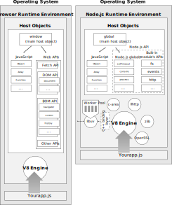
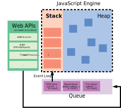

# Asynchronous Programming Fundamentals

## References
* [MND: .../docs/Learn/JavaScript/Asynchronous/Concepts](https://developer.mozilla.org/en-US/docs/Learn/JavaScript/Asynchronous/Concepts)
* [MDN: .../docs/Learn/JavaScript/Asynchronous](https://developer.mozilla.org/en-US/docs/Learn/JavaScript/Asynchronous)

## FAQ
* *Is Asynchronous and Non-blocking are two different things?*  

  No, this is the same thing. "blocking code/function" means "synchronous code" and "non-blocking code/function" means asynchronous code. I.e. if the function is not blocking,  it is asynchronous.
* *What determines which Javascript functions are blocking vs non-blocking?*  

  Just read the documentation for the function you are using, there will be the info is the function is blocking or non-blocking. [Details](https://softwareengineering.stackexchange.com/questions/202047/what-determines-which-javascript-functions-are-blocking-vs-non-blocking)
* Microtasks are used “under the cover” of `await` as well, as it’s another form of promise handling ([source](https://javascript.info/event-loop#macrotasks-and-microtasks))
* `fetch` responses end up in Macrotask!
* promises use Microtask Queue
* Note that the terms *thread worker*, *worker*, and *thread* are often used interchangeably; they all refer to the same thing. Also *Thread Pool* = *Worker Pool* = *`libuv`'s threadpool*

---

**JavaScript is at its most basic a *synchronous*, *blocking*, *single-threaded* language.** That is, the JavaScript engine can only process one statement at a time in a single thread. In this article we will explore what each of these things means. 

There are two main entities: **Engine** and **Runtime Environment**. Let's find out what're they doing.

## Engine
> = interpreter

As you may heard before, JavaScript is an *interpreted programming language*. It means that source code isn’t compiled into binary code prior to execution.

How your computer can understand what to do with a plain text script?

That’s the job for a JavaScript engine. 

In simple words: the Engine handles interpreting and running your JavaScript code. 

In a more technical words: a JavaScript engine is a program that translates (aka compiles) your script's source code into runnable machine code instructions so it can be executed by the CPU of the host machine. The engine translates scripts at runtime on the fly. Your code won’t be compiled unless you run it. 

The engine is a container in which you run your program.


The cool thing is the *JavaScript engine implementation is totally independent of the Runtime Environment*. Engines aren’t developed with any particular environment in mind. There’s a real-life example which demonstrates this approach is working. You can find the V8 engine both in Chrome browser and NodeJS. One engine successfully utilized in two environments created for totally different uses.

**The Engine consists of:**

* **Heap** — a large unstructured data structure which stores all the dynamic data like function definitions, objects, arrays etc. Execution context stack just contains their reference or in other words stores their memory addresses where these function definitions, objects and arrays are stored. The memory occupied in the heap continues to exist even after the JavaScript code execution has completed. They are removed by the JavaScript Garbage Collector.
* **Call Stack**

**These are the main functionalities of the Engine:**

* Compiles and executes JS code
* Handles call stack — running your JS functions in some order
* Manages memory allocation for objects — the Memory Heap
* Garbage collection — of objects which are no longer in use
* Provide all the data types, operators, objects and functions

**What are the most important JavaScript engines?**

* **V8** – As you probably guessed the engine shipped in Google Chrome. It’s an open source project written in C++. V8 is also used in Opera, NodeJS, and Couchbase.
* **SpiderMonkey** – The open source engine implemented in C++. It’s maintained by Mozilla Foundation. You can find it in Firefox.
* **Nitro** (Safari) – The engine developed by Apple. It’s used in Safari.
* **Chakra** – Developed by Microsoft as the JavaScript engine for Edge browser.

But JavaScript engine is just a building block of a bigger concept. Let's discuss Runtime Environemnt.


## Runtime Environment

In the web development, you don’t usually use the engine directly. The JavaScript engine works inside an environment, which provides additional features (libraries, APIs) to your scripts that you can use at runtime to communicate with the world surrounding the engine. *The engine itself doesn’t depend on them.*

**In general Runtime environment consists of the following entities:**

* **Event Loop**
* **Macrotask Queue** (aka Message Queue)
* **Microtask Queue** (aka Job Queue)
* **Tasks** (aka Messages) (put in aforementioned Queues)
* **APIs** (provided by Runtime Environment; in browser Runtime Environments provides us with Web APIs and in Node.js environment - with Node.js APIs)

There are a few other entities, but I'll mention them while discussing Browser/Node.js Runtime Environments.

Note that although both Chrome browser and Node.js use the same engine (V8), their Runtime Environments are different. In short browser and Node.js Runtime Environments are different in:
- provided APIs
- Event Loop Implementation
- some other stuff, that I'll explain below



**ILLUSTRATION NOTE 1:** there is no "Worker Pool" in browser, it just creates threads by itself or somehow else, there is no info on Internet how it manages its threads)
**ILLUSTRATION NOTE 2:** as your remember we have Native Objects aka JS built-ins and Host Objects. So here is the mental model note: Native Objects (all JavaScript native objects/methods) are supplied by JavaScript Engine itself i.e. it provides them to the Runtime Environment, which then takes them and exposes through its main Host Object `window`/`global`/...

Now, lets take a step back and discuss what is threadening.


# Threading

**Threading** is how many operations the interpreter can execute simultaneously (at a single point in time). Programming languages can be divided into:
  * **single-threaded** - at a single point in time, the interpreter can run only one operation
  * **multi-threaded** - at a single point in time, the interpreter can run two or more operations

By default, the Chrome browser creates an entirely separate operating system process for every single tab or extra extension you are using. Same with Node - it create a separate process for each script. And as we now, each process is single-threaded.

**Both Browser and Node.js Runtime Environments provide only a single-thread for JavaScript execution per realm (loosely, window/tab)**. Sometimes that one thread is shared across realms (for instance, when multiple windows/tabs have access to each other's code).

**Both of these Environments provide us with APIs (*Web APIs* in browser runtime environment, *Node.js APIs* in Node.js runtime environment). Some of these APIs (i.e. functions belonging to these APIs) are allowed to use multiple threads to execute asynchronous tasks.** But where do these APIs take these threads? 

**In browser**, the browser itself creates threads for executing certain Web APIs tasks. 

**In Node.js** the library called `libuv` has a Worker Pool and it just takes threads from this pool and assigns asynchronous tasks to execute in a specific threads. 

(*certain tasks* means the tasks that we usually consider *asynchronous*: network operations, reading files from the disk, timers, events, ... . Full list of them see in article "Event Loop"). 

> Does each event listener or timer or network operation creates a new thread? Well, the problem is how browser manages Web APIs threads is not documented anywhere so we can only guess how many threads it creates (at least I haven't found any useful information). For Node.js APIs we have some info, part of it will be explained below but concerning the details specofically about threads for timers, events etc. I haven't found any info.
So, **it's best to imagine that in both browser and Node.js Runtime Environment, APIs are executed in one or more separate concurrent threads at the same time as the main JavaScript thread executes. Those other threads can add tasks to the Queue that will be picked up by the Event Loop running on the main JavaScript thread. So we don't have to worry about thread management and order of execution, Runtime Environment does it for us using Event Loop.** Lets reiterate: 
1. once that background thread completes it returns the result, and ... 
2. once the current call stack finishes executing, your callback function is provided with this result of execution of this concurrent thread and ...
3. your calback function is pushed onto the (now empty) call stack and runs-to-completion. 
   
So your JavaScript code itself executed on a main single thread, but it orchestrates legions of threads with the help of Event Loop!

For example when we schedule some timers or add event listener, Web APIs/Node.js APIs start listening to the events in separate thread (or threadS (these details are not document as I've already explained above)). Then when some event happens or timer elapses, Web APIs/Node.js APIs running on a separate thred(s), add tasks ("execute callback <xxx>") to the Queue belonging to the main thread. These tasks will be sequentially processed in the main thread, in an endless loop — Event Loop (this Event Loop runs on the main thread and is a part of the browser/Node.js Runtime Environment).

**But what if we still want want a real traditional concurrency i.e. to have multiple threads?** 
  * [Stackoverflow Answer](https://stackoverflow.com/questions/18613023/how-to-create-threads-in-nodejs)
  * with some limitations, we can achive a real concurrency (multi-threadening) by utilizing WebWorkers ([`webworker-threads`](https://www.npmjs.org/package/webworker-threads)) or through built-in [`cluster`](http://nodejs.org/api/cluster.html) module 
  * Also we can *imitate*(to fake)* concurrency (multi-threaded behavior) by implementing some way of chunking up your work and manually using `setTimeout` or `setImmediate` or `process.nextTick` to pause your work and continue it in a later loop to let other processes complete (but that's not recommended). 




 

#### Browser Runtime Environment

Consists of (only most important parts):
  * Event Loop
  * Macrotask Queue
  * Microtask Queue
  * Tasks
  * Web APIs 

Browser Runtime Environment provides **Web APIs** (aka browser APIs): you have `window` as the main host object. Through it the Runtime Environment (browser) exposes Native JS objects/functions and Web APIs (among them is the DOM API, it provides the stuff like `document` object, `addEventListener()`, `setTimeout`, ...), Fetch API, Console API, etc.). **Note**: there is no one "Web API"; there are dozens of separate APIs implemented in web browsers i.e. provided to JavaScript by Runtime Environment - the browser. Among Web APIs are for exampe, DOM API and many other APIs.  


#### Node.js Runtime Environment
> More details: https://itnext.io/an-intro-to-node-js-that-you-may-have-missed-b175ef4277f7

Consists of (only most important parts):
  * Event Loop
  * Macrotask Queue
  * Microtask Queue
  * Tasks
  * Node.js API (providing globals, native modules' APIs)
  * libraries: `libuv`, `c-ares`, ... (full list in [Doc](https://nodejs.org/en/docs/meta/topics/dependencies/))

> **When we say "Node.js", technically it means "Node.js Runtime Environment" i.e. Node.js IS the Runtime Environment.** In essense Node.js was developed to replicate the browser Runtime Environment outside an actual browser. 
> Also, I've already explained it above but I want to repeat: when you're writing code, you're not in a “runtime environment”. The moment you do `npm start` (or whatever command you're using to start your application), you're in a “runtime environment”.

Node.js Runtime Environment replaces Web APIs with **Node.js APIs**: you have `global` main host object which provides you with globals like `require`, `setTimeout`, `console`, `Buffer`, `process`es, etc. Node also gives you host objects in the form of built-in modules.

**Node.js and Chrome browser have different Event Loop implementation, so they are executed differently. Node.js uses Event Loop implemented in `libuv` library**. 

**`libuv` library is provided by Node.js Runtime Environment and is completely written in C. Its main responsibility is to provide non-blocking I/O operations — primarily, non-blocking interactions with the system’s disk and network. It provides mechanisms to handle file system, DNS, network, child processes, pipes, signal handling, polling and streaming. It also includes a Worker Pool (aka Worker Pool) for offloading work for some things that can't be done asynchronously at the operating system level** (more on this below). By default, there are four threads in it. We could increase or reduce this Worker Pool by calling `process.env.UV_THREADPOOL_SIZE` at the top of our script.

Thanks to `libuv` we can use Node.js to to implement any sort of server executing any TCP or UDP protocol, whether it's domain name system (DNS), HTTP, internet relay chat (IRC), or FTP.

([source](https://stackoverflow.com/questions/22644328/when-is-the-thread-pool-used))  The strategy used by `libuv` to achieve asynchronous I/O is not always a Worker Pool, specifically in the case of the `http` module a different strategy appears to be used at this time. For our purposes here it's mainly important to note how the asynchronous context is achieved (by using `libuv`) and that the Worker Pool maintained by `libuv` is one of multiple strategies offered by that library to achieve asynchronicity.

> Cause Worker Pool is implemented in `libuv`, this results in a slight delay whenever Node needs to communicate internally between JavaScript and C++, but this is hardly noticeable.

With `libuv` library and Worker Pool which it provides we're able to write the code like this:

```js
fs.readFile(path.join(__dirname, './package.json'), (err, content) => {
 if (err) {
   return null;
 }
 console.log(content.toString());
});
```

([source](https://stackoverflow.com/questions/22644328/when-is-the-thread-pool-used)) Certain functions and modules, usually written in C/C++, like `fs` in example above, support asynchronous I/O operations. When you call these functions and methods, they internally manage passing the call on to a worker thread. For instance, when you use the `fs` module to request a file, the `fs` module passes that call on to a Worker Pool (which is, in a broad sense, can be considered a "Node.js API" entity i.e. a part of it to be precise) asking it to use one of its threads to read the contents of a file and notify the Event Loop (running on a main thread) when it is done. The Event Loop then takes the provided callback function and executes it with the content of the file.

Above is an example of a non-blocking code; as such, we don’t have to wait synchronously for something to happen. We tell the Worker Pool to read the file (using one of available threads) and call the callback function (to be precise - to create a new task in the Queue) with the result of operation. Since Worker Pool has its own threads, the Event Loop on the main thread can continue executing normally while the file is being read.

**Blocking:** (thread blocking = event loop blocking) It’s all good until there’s a need to synchronously execute some complex operation: any function that takes too long to run will block the thread. If an application has many such functions, it could significantly decrease the throughput of the server or freeze it altogether. **In this case, there’s no way of delegating the work to the Worker Pool :(**. If you're writing long running/blocking code in javascript, you're probably making a mistake. Other languages will perform much more efficiently.

Fields that require complex calculations — such as AI, machine learning, or big data — couldn’t really use Node.js efficiently due to the operations blocking the main (and only) thread, making the server unresponsive. That was the case up until Node.js v10.5.0 came about, which added support for multiple threads.

**Some additional points:** 

* Any external module that you include in your project that makes use of native C++ and `libuv` is likely to use the Worker Pool (think: database access)

* `libuv` has a default Worker Pool size of 4, and uses a queue (not the Queue in a sense of Micro/macro-tasks; its different unrelated queue) to manage access to the Worker Pool - the upshot is that if you have 5 long-running DB queries all going at the same time, one of them (and any other asynchronous action that relies on the Worker Pool) will be waiting for those queries to finish before they even get started. 
  
  Reiterate in my own words: so when `libuv` needs to perform some operation that needs a new thread, it looks into Worker Pool checking is there available thread? If yes, it takes it and assignes the function to this thread. If there is no available threads, `libuv` waits using internal queue to manage functions demanding new threads.

* You can mitigate this by increasing the size of the Worker Pool through the UV_THREADPOOL_SIZE environment variable, so long as you do it before the Worker Pool is required and created: `process.env.UV_THREADPOOL_SIZE = 10;`

* Note that the threads in the Worker Pool may block (for example, waiting for a disk access), but this doesn’t block the JavaScript engine which runs in its own thread. If all the threads in the Worker Pool are busy and new tasks from the JavaScript Engine arrive, then these new tasks are simply queued up by `libuv` and they will be processed as soon as a worker thread becomes free.

  **Promises don't "run", they're just objects representing a result. The actually asynchronous stuff like timeout, outgoing network requests, I/O operation and such is started by a specific function that has nothing to do with promises, and how the asynchronous task is executed depends on what the specific task is. And `async`/`await` code is just like normal `then` callbacks, it runs in the same main loop as all other JS code.**


# Synchronicity vs Asynchronicity

**Synchronicity/Asynchronicity** - these terms describe *how* the code in the thread(s) is executed. We can divide all JavaScript code into:

* **synchronous code** (synchronous execution) is the code, which the interpreter runs on the main thread. It is executed *sequentially*, line by line, from top to bottom; all instructions are executed in the same order they appear in your program. When someone says that a programming language is synchronous he means exactly this: a language has only one thread and all the code being executed runs on it sequentially.  
   
  When you invoke a synchronous functions, their EC is immediately added to the stack, executes, and removed from it *only when the execution is completely finished*. Such code is a blocking code, it blocks the Event Loop cause it prevents the further execution of a program i.e. if any operation (some function for instance) executes for too long, all other operations suspended, waiting for the current operation being finished. Such situations called "thread blocking" or "Event Loop blocking" or just "blocking" and the code causing them — "blocking code". I.e., the function suspends (blocks) the execution of all the code following right beneath her invocation and as a consequence, all the queued tasks in Macrotask Queue. The blocking lasts until the function is completely executed, and her EC is removed from the stack.
* **asynchronous code** (asynchronous execution) - код, который интерпретатор выполняет в параллельном потоке, concurrently i.e. at the same time as the main thread т.е. это код, а если быть более точным, функция/метод, которые разрешают интерпретатору удалять их EC из стека, не дожидаясь окончания их выполнения. Это означает, что эти функции - не блокирующие поток, в отличии от синхронных, иными словами, они — асинхронные. Почему они такие? Потому что они всегда предоставляются Runtime Environment'ом и написаны на C/C++ и внутри реализованы таким образом что они не блокируют Event Loop а спокойно удаляются из стека и затем выполняются в параллельном потоке. Асинхронная функция запускается синхронно т.е. так же как и обычная синхронная функция, но в отличие от синхронной, её EC сразу после запуска удаляется из стека таким образом не блокируя выполнение нижеидущего кода. Интерпретатор идёт выполнять код дальше, а данная функция тем временем выполняется фоном в параллельном потоке т.е. асинхронно. Таким образом блокировки потока не происходит.

All JavaScript native code (i.e. functions provided by JavaScript itself and not by the Runtime Environment (i.e. some external APIs)) is synchronous. 

> There are only two slippy cases: **Promise handlers (`then`, `catch`, `finally`) and `async`/`await` are "asynchronous".** I use quotes cause they are not asyncrhonous in litteral sense: technically speaking these functions are synchronous as any other native JavaScript code. The reason we often call them "asynchronous" is because they *manage* (*handle*, *make use of*) the real asynchronicity provided by the Runtime Environment (browser APIs/Node.js/...). So the asynchronicity is not baked into these functions, rather it is provided by the external environment.  
> 
> Lets reiterate: Promises and `async`/`await` are not asynchronous, they are just *means* to handle asynchronous code. They use Event Loop and Node.js API creates for them tasks in a Queue, so they don't create any new threads. But the *asynchronous function* they handle (like `fs.readFile` in `await fs.readFile(...)` is a part of Node.js Runtime Environment (i.e. part of Node.js API provided by Environment), so while executing, under the hood `fs` urilizes one of the threads in Worker Pool.

Thus, as follows from the aforementioned, all asynchronous functions are non-native i.e. they are provided by APIs which are in turn provided by the Runtime Environment like browser or Node.js.

These APIs can’t themselves put the execution code on to the stack, if it did, then it would randomly appear in the middle of your code. Any of the Web API pushes the callback onto this Queue when it’s done executing. The Event Loop now is responsible for the execution of these tasks i.e. callbacks in the queue and pushing it in the stack, when it is empty. Event Loop basic job is to look both at the stack and the Queue, pushing the first thing on the Queue to the stack when it see stack as empty. Each task (callback) is always processed completely before any other task is processed, hence all callbacks in the Queue have to wait until the current one is finished. If a script runs too long, it blocks others. **That’s why callbacks should be relatively short and simple.** If you put some heavy computations in it, it will block the thread.

Now, as for the list of asynchronous functions, here they are (remember all of them provided by Runtime Environment):

* `XMLHttpRequest` (for making network requests); it can be used in two modes: synchronous or asynchronous)
* I/O operations (including запросы к БД и др. операции связанные с базой данных)
* ряд функций принадлежащих [Web APIs](https://developer.mozilla.org/en-US/docs/Web/API): 
  * DOM API: one of Web APIs is a DOM API, it provides function `setTimeout`, `addEventListener`, ...
  * Fetch API (for making network requests)
* Node.js filesystem operations

So, when you hear folks say that JavaScript is an asynchronous language, what they mean is that you can manipulate JavaScript to behave in an asynchronous way. It’s not baked in, but it’s possible! It is up to the programming environment you are using (web browsers, in the case of web development) to provide you with APIs that allow you to run such tasks asynchronously.

Whether we want to run code synchronously or asynchronously will depend on what we're trying to do.

There are times when we want things to load and happen right away. But if we're running a computationally expensive operation like querying a database (which are usually implemented as asynchronous function and provided by Runtime Environment) and using the results to populate templates it is better to push this off the main thread and complete the task asynchronously.


## Synchronous code execution

Повторим ещё раз: что такое синхронное выполнение кода? Это обычное выполнение кода в JS: интерпретатор читает и выполняет код последовательно - сверху вниз, строка за строкой. Он не может перейти к выполнению следующего задания (EC), если текущее задание (EC) ещё до конца не выполнено и находится в стеке. Такая ситуация называется блокировкой, о ней и пойдёт речь далее.


### Блокировка потока

Any JavaScript code that takes too long to return back control to the Event Loop will block the execution of any JavaScript code in the page, even block the UI thread, and the user cannot click around, scroll the page, and so on.

При синхронном выполнении, если интерпретатор выполняет какой-то EC, то никакая другая операция в этот момент выполнена быть не может, и перейти к следующей операции тоже невозможно, пока текущий EC не будет выполнен на 100%.     
Т.е. всё заблокировано, пока не выполнится текущий EC. Обычно выполнение занимает доли секунды и мы не замечаем никакой задержки/подвисания. Но если этот EC выполняется долго (например *синхронный* запрос к БД или обычная функция, но требующая больших вычислений) - наступает жопа: как я уже сказал, этот EC блокирует выполнение любого JavaScript кода на странице, даже интерфейс браузера, он не реагирует ни на какие действия пользователя: пользователь не сможет кликнуть мышкой, не сможет скроллить страницу и т.п. Такая ситуация называется блокировкой потока.

**Пример:** блокировка потока при выполнении синхронной слоупок-функции (например, функции производящей большие вычисления или при выполнении синхронного запроса к БД)
```js
computationHeavyTask(); // как вариант, тут мог быть синхронный запрос к БД, типа databaseRequest();
consol.log('hi');
```
Предположим что синхронная функция/метод `computationHeavyTask()` даже не предусматривает возможности указать в её параметре нашу собственную колбэк фукцию, т.е. она определена максимально примитивно, примерно так: `computationHeavyTask() { ... }`. В такой ситуации, итерпретатор начав выполнять эту функцию, не сможет удалить её долго-выполняющийся EC из стека, пока не выполнит её полностью. А раз из стека текущий EC быть удалён не может, значит и новый EC `console.log('hi')` в стек добавлен быть не может, т.е. интерпретатор не может перейти к дальнейшему выполнению кода пока полностью не выполнит текущий. Только когда синхронная ф-я `computationHeavyTask()` или какая-нибудь `databaseRequest();` наконец полностью выполнится и её EC удалится из стека, сработает `hi`.

Избежать блокировки при синхронном выполнении кода невозможно. Но можно вернуть себе немного контроля над очерёдностью выполнения функций, при помощи двух стандартных методов написания синхронного кода: сallbacks и `Try...catch` blocks. О них и пойдёт речь далее.


### `Try...catch` blocks

Another way to write synchronous code is to create `try...catch` blocks. The idea behind `try...catch` blocks is to run instructions in sequence but also react appropriately if any of the commands fail

### Сallbacks

Callbacks are functions that are passed into other functions as arguments and are called when certain conditions occur. Callback functions can be named or anonymous functions. 

**Пример: ещё один пример использования колбэка это метод `forEach()`. Это уже синхронный колбэк**:
```js
/* the expected parameter of forEach() is a callback function, which itself takes two parameters, a reference to 
the array name and index values */

const gods = ['Apollo', 'Artemis', 'Ares', 'Zeus'];

gods.forEach(function (eachName, index) {
  console.log(index + '. ' + eachName);
});
```


**Пример: мы можем написать и свой синхронный колбэк**:

```js
function greeting(name) {
  alert('Hello ' + name);
}

function processUserInput(callback) {
  let name = prompt('Please enter your name.');
  callback(name);
}

processUserInput(greeting);
```
Т.е. when we pass a callback function as a parameter to another function, we are only passing the function definition as the parameter — the callback function is not executed immediately. It is “called back” (hence the name) synchronously, somewhere inside the containing function’s body. The containing function is responsible for executing the callback function when the time comes.

Примеры выше демонстрируют разнообразие колбэков - они не только позволяют to control the order in which functions are run and data is passed between them, it also allows you to pass data to different fuctions depending on circumstance. So you could have different actions to run on the user details you want to process like `greeting()`, `goodbye()`, `addToDatabase()`, `requestEmailAddress()`, etc.

However, for all their usefulness, such callbacks are still synchronous. *They are still blocking the thread when they run*.


## Asynchronous code execution

> **Attention!** All the theory from this point and on till the end of page (article) will be concerned with "Why do we need asynchronous code and use cases of implementing async code". If you need to quickly recall how asynchronous code executes stop reading here, and go to other articles.  

Способы реализации асинхронного выполнения операций (функций и пр.) включают:
  - сторонние асинхронные callback-функции предоставляемые by Runtime Environment (browser/Node.js/...) (`addEventListener()`, `setTimeout`...)
  - `Promise`
  - `async`/`await`

For the reasons illustrated earlier related to blocking (among many other reasons), many Web API features now use asynchronous code to run, especially those that influence or fetch some kind of resource from an external device, such as fetching a file from the network, accessing a database on the server and returning data from it, accessing a video stream from a web cam, or broadasting the display to a VR headset. Что касается браузерных API которые являются асинхронными, выше они уже были перечисленны (DOM API (`setTimoute`, `setInterval`, `addEventListener`), Fetch API, ...). Все эти функции и API предусматривают возможность указать нашу собственную функцию, в качестве асинхронного колбэка который выполнится в соответствии с Event Loop model.

**Важное замечание. В JavaScript все асинхронные функции, запускаются также как синхронные — в общем потоке.** Разница между синхронной и асинхронной функциями лишь в том, как после своего запуска (создания EC) они выполняются: прежде чем выполнение кода перейдёт к следующей строчке, EC синхронной функции должен выполниться на 100% и удалиться из стека. В случае же с асинхронной функцией, её EC добавляется в стек и сразу удаляется, не дожидаясь окончания выполнения, и выполнение кода сразу переходит к следующей строке. А асинхронная функция тем временем продолжает выполняться фоном в параллельном потоке.
```js
console.log('a');
setTimeout(() => console.log('c');
console.log('b');
```


### Асинхронные callback-функции

В продолжении предыдущей темы про колбэки, вот пример уже асинхронного колбэка: event handler, т.е. второй параметр в в методе `addEventListener()`. The first parameter is the type of event to be listened for, and the second parameter is a function that is invoked when the event is fired. 

I’ll remind you right away: `addEventListener` is provided by Web API, it is not a part of JS. `addEventListener` is asynchronous. It runs sync as any other async function, and attaches the event handler, but then it is removed from the Stack and it waits in background in concrurrent thread for an event to happen. So the process of "waiting in background" in this case means "executes in background". 

When we clicked, the execution finally finished, so Web API returned the result of the operation (event object with info about click) and created a message in Macrotask Queue with this callback (event handler function), providing this callback with the returned result (event object) as argument. 

What happens next is the standard behavior of Event Loop - read about this in related article; here is a short explanation: 
1. after the JS Engine will finish processing the entire code of the script file, according to Event Loop model, it will check the Microtask Queue and execute ALL tasks from this Queue
2. then the browser will render the page
3. then JS Engine will check Macrotask Queue again and execute your event handler task (i.e. callback)

```js
// Упрощённо можно представить что внутри addEventListener() выглядит так: 
function addEventListener(arg1, arg2) {
    // ...
    arg2(); // вызов колбэка. Сообщение с именно этим приаттаченным колбэком создаёт Web API в Macrotask Queue,
}

// а вот непосредственно использование колбэка в ф-ции addEventListener(). 2-й параметр это и есть наш колбэк
alertBtn.addEventListener('click', () =>
  alert('You clicked me!')
);
```


### Promise

**Пример: Fetching data from the server**. Понимать что тут в каждой строке происходит не требуется, мы разберём это в другой главе, про Promises. Суть в том, что мы получаем данные из файла при помощи метода `fetch()`, который, является асинхронным, он принадлежит асинхронному API
```js
console.log('1');

fetch('https://api.mixcloud.com/spartacus/')
  .then(response => {
    console.log(response);
    return response.json();
  })
  .then(user => console.log(user)); //

console.log('2');
```

The [`fetch()`](https://developer.mozilla.org/en-US/docs/Web/API/Fetch_API) method is async and is handled by Macrotask Queue (yep, mAcrotask), I won't explain here all the details of execution cause you should know them already from the article about Event Loop; if you don't understand something, read the article abouter Event Loop. Nevertheless, here is a brief explanation:

- output `1`
- after `fetch()` invocation and creation of its EC, his EC instantly removed from the stack  (so it *does not block* subsequent JavaScript code from running) and sync code under `fetch(...` continues to execute: in our case the next sync code is `console.log('2');`. 
- meanwhile our async method `fetch` continuous its execution in background in parallel thread. After `fetch` method got the file from the server, Fetch API generates a message into a Macrotask Queue and associates callback function we gave to `then` with this message. 
- after the main thread (i.e. the first task/message from Macrotask Queue) has finished processing, according to Event Loop model, JS Engine checks Microtask Ququq — it is empty, so rendering of the page happens. Then, JS Engine check Macrotask Queue again and sees there is a message from Fetch API. Then, it checks the stack and sees it is empty. So it starts processing the Queue: it takes the message with associated callback function (the callback we passed to `then`), takes this function and passes it to call stack, so the function is invoked and runs.


## Mixing sync and async code

Let's explore what happens when we try mixing sync and async code, so we can further understand the difference. The following example is fairly similar to what we've seen before.

```js
console.log ('Starting');
let image;

fetch('coffee.jpg').then((response) => {
  console.log('It worked :)')
  return response.blob();
}).then((myBlob) => {
  let objectURL = URL.createObjectURL(myBlob);
  image = document.createElement('img');
  image.src = objectURL;
  document.body.appendChild(image);
}).catch((error) => {
  console.log('There has been a problem with your fetch operation: ' + error.message);
});

console.log ('All done!');
```

1. The browser will begin executing the code, see the first `console.log()` statement (`Starting`) and execute it, and then initialize the `image` variable.
2. It will then move to the next line and begin executing the `fetch()` block but, because it is async and not blocking, it will move on with the code execution, finding the last `console.log` statement (`All done!`) and outputting it to the console.
3. Only once the `fetch()` block has completely finished running and delivering its result through the `.then()` blocks will we finally see the second `console.log()` message (`It worked ;)`) appear. So the messages have appeared in a different order to what you'd expect:
   1. Starting
   2. All done!
   3. It worked :)

In a less trivial code example, this could cause a problem — you can't include an async code block that returns a result, which you then rely on later in a sync code block. You just can't guarantee that the async function will return before the browswer has processed the async block.

To see this in action, try taking a local copy of того примера кода что выше, and changing the third `console.log()` call - `console.log ('All done!');` to the following:

```js
console.log ('All done! ' + image + 'displayed.');
```

You should now get an error in your console instead of the third message: (на деле, на самом деле этой ошибики не отображается, это пример и теория из статьи на MDN, скорей всего там ошибка. На деле, вместо ошибки показанной ниже у нас отобразится: `Starting` — `All done! undefineddisplayed.` — `It worked :)`)

```js
TypeError: image is undefined; can't access its "src" property
```

This is because at the time the browser tries to run the third `console.log()` statement, the `fetch()` block has not finished running so the `image` variable has not been given a value (but even if it would have finished running, the result would be the same cause the ,essage from Fetch API will be handled only *after* all sync code in the script (recall: all code inside a file wrapped in a single anonymous function and handled by Macrotask Queue as a single task, whitch must be 100% complete before handling Microtask Queue -> rendering -> and then handling 1 task from Macrotask Queue again).

To fix the problem described above, the best way is to make the third `console.log()` statement run async as well. This can be done by moving it inside another `.then()` block chained onto the end of the first one, like we saw earlier on. Вот [пример](https://github.com/mdn/learning-area/blob/master/javascript/asynchronous/introducing/async-sync-fixed.html) как надо.


